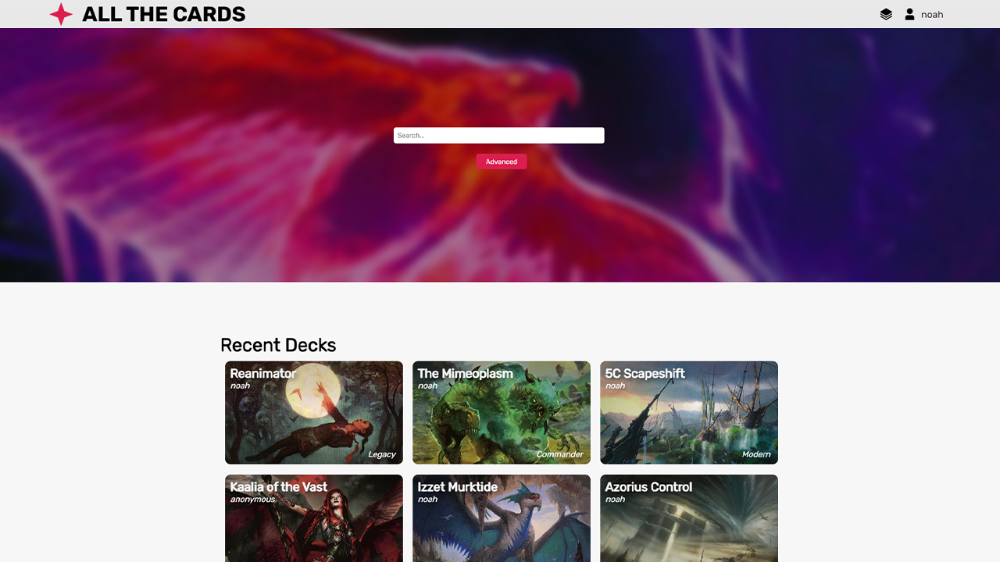

# 🃏 All The Cards
## Front-End Developer & UI Lead
All The Cards is a Magic: The Gathering deckbuilder and card database built in React.js using a feature-branch workflow. With a component-driven architecture, it was easy to map our database to custom objects for displaying cards and decks to the user.

We used [Scryfall API](https://scryfall.com/docs/api) to build our [Supabase](https://supabase.com/docs/guides/api) database with, and I used [React Mana by Saeris](https://github.com/saeris/react-mana) to help build out the decklist style. In combination with our dataset, I was able to convert raw mana text, like `{2}{R}{R}`, into the symbols dynamically from any string. This melded perfectly with the component-driven architecture to quickly map the raw data from our database into a page that looks great and communicates data to the user in a digestible way.

<picture>
    <source srcset="./assets/homepage.png" width="48%" media="(min-width: 1100px)"/>
    
</picture>
<picture>
    <source srcset="./assets/deckpage.png" width="48%" media="(min-width: 1100px)"/>
    
</picture>
<picture>
    <source srcset="./assets/deckstats.png" width="48%" media="(min-width: 1100px)"/>
    
</picture>
<picture>
    <source srcset="./assets/cardpage.png" width="48%" media="(min-width: 1100px)"/>
    
</picture>
<picture>
    <source srcset="./assets/userpage.png" width="48%" media="(min-width: 1100px)"/>
    
</picture>