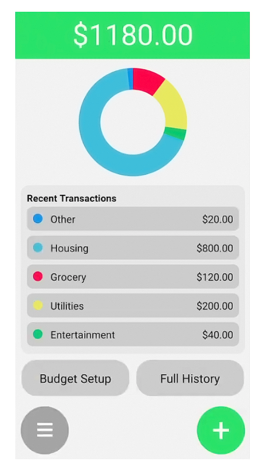
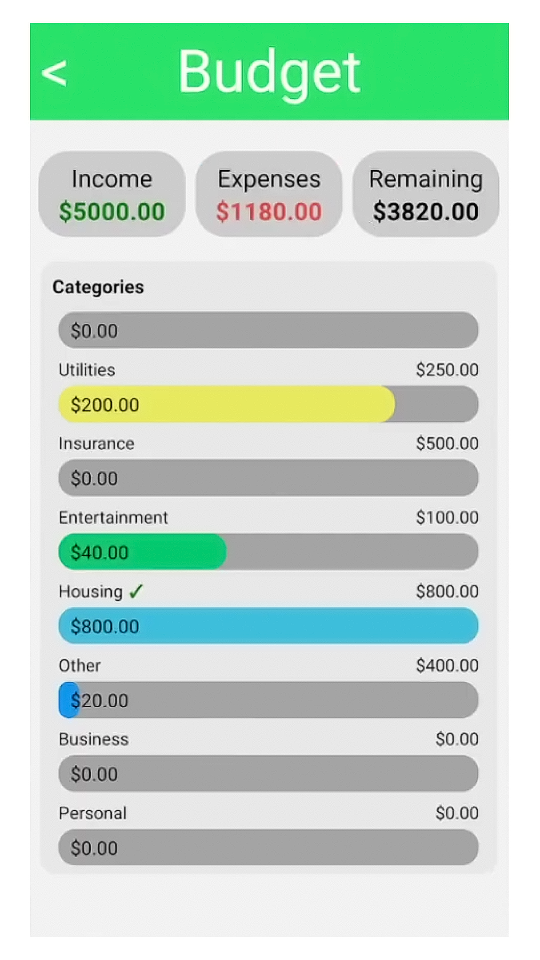
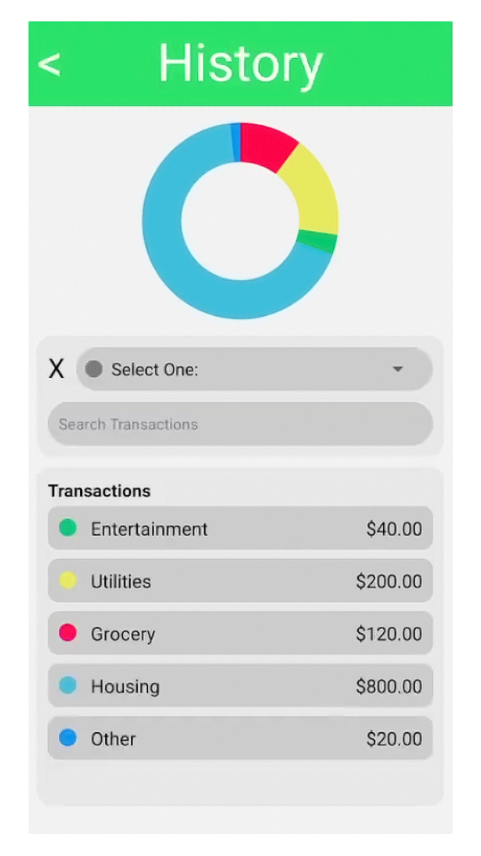
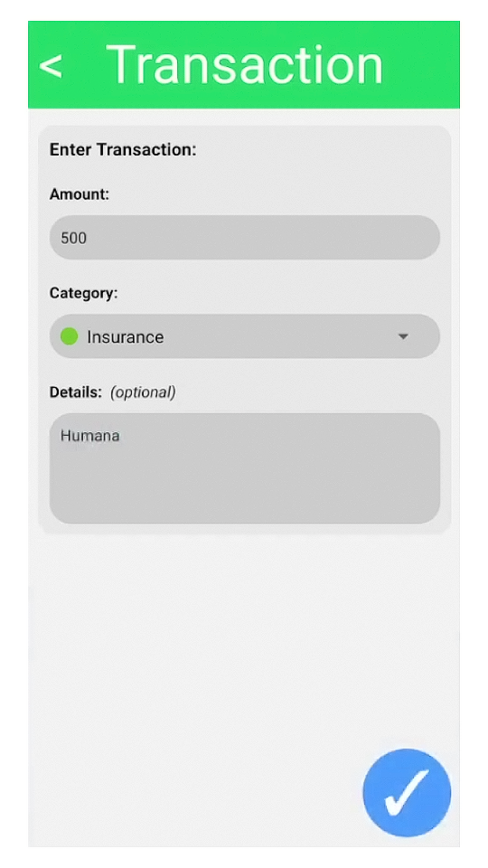

# 💵 $pent
## Developer & UI Lead
$pent is a mobile app built with React Native for setting up and managing your monthly budget. 

<picture>
    <source srcset="./assets/home.png" width="24%" media="(min-width: 1100px)"/>
    <source srcset="./assets/home.png" width="48%" media="(min-width: 800px)"/>
    
</picture>
<picture>
    <source srcset="./assets/budget.png" width="24%" media="(min-width: 1100px)"/>
    <source srcset="./assets/budget.png" width="48%" media="(min-width: 800px)"/>
    
</picture>
<picture>
    <source srcset="./assets/history.png" width="24%" media="(min-width: 1100px)"/>
    <source srcset="./assets/history.png" width="48%" media="(min-width: 800px)"/>
    
</picture>
<picture>
    <source srcset="./assets/transaction.png" width="24%" media="(min-width: 1100px)"/>
    <source srcset="./assets/transaction.png" width="48%" media="(min-width: 800px)"/>
    
</picture>