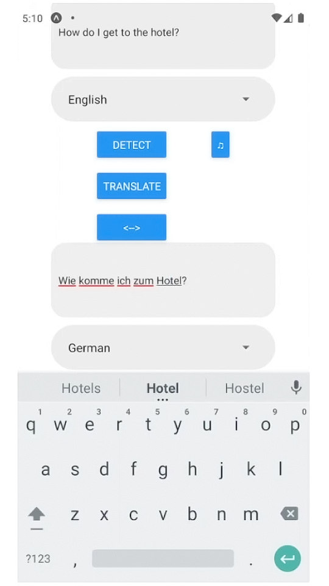
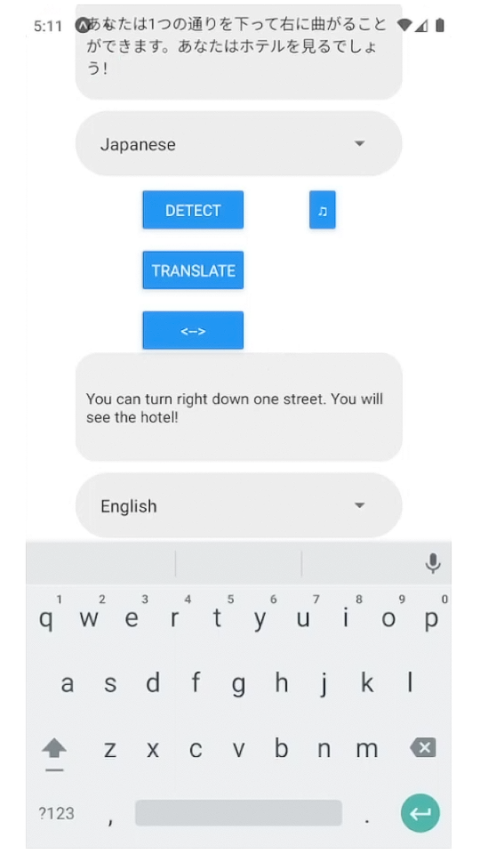
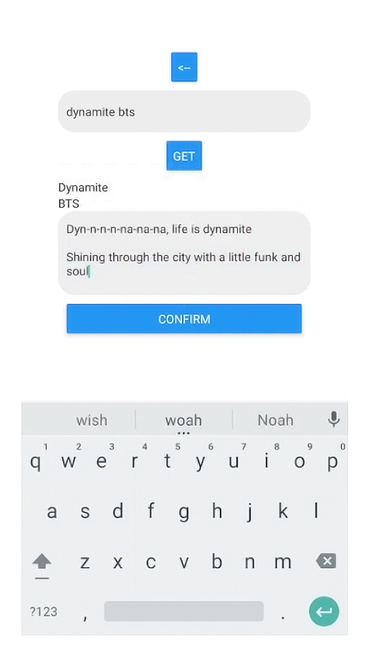
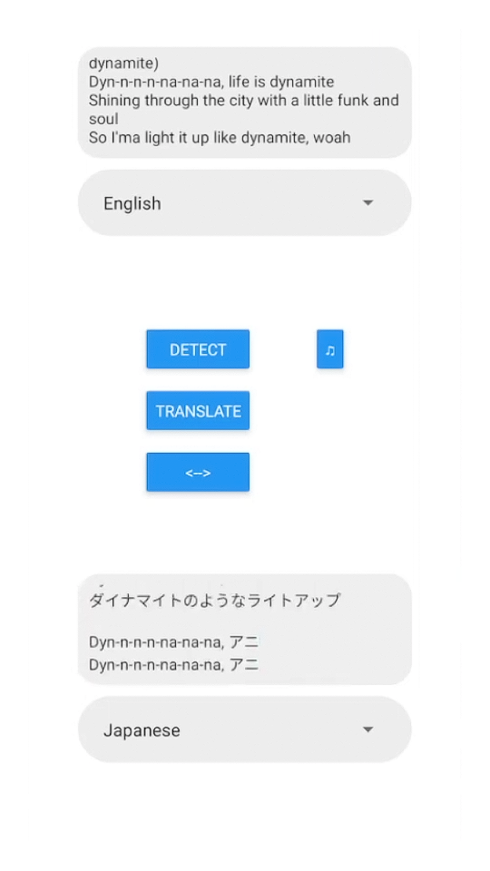

# 🎵 Translate You
## Solo Developer
Translate You is a mobile translation app built with React Native, with integrated song lyric lookup and translate powered by [lyrics.ovh](https://github.com/NTag/lyrics.ovh) and [LibreTranslate](https://github.com/LibreTranslate/LibreTranslate)

<picture>
    <source srcset="./assets/translate1.png" width="24%" media="(min-width: 1100px)"/>
    <source srcset="./assets/translate1.png" width="48%" media="(min-width: 800px)"/>
    
</picture>
<picture>
    <source srcset="./assets/translate2.png" width="24%" media="(min-width: 1100px)"/>
    <source srcset="./assets/translate2.png" width="48%" media="(min-width: 800px)"/>
    
</picture>
<picture>
    <source srcset="./assets/songlookup.png" width="24%" media="(min-width: 1100px)"/>
    <source srcset="./assets/songlookup.png" width="48%" media="(min-width: 800px)"/>
    
</picture>
<picture>
    <source srcset="./assets/songtranslate.png" width="24%" media="(min-width: 1100px)"/>
    <source srcset="./assets/songtranslate.png" width="48%" media="(min-width: 800px)"/>
    
</picture>